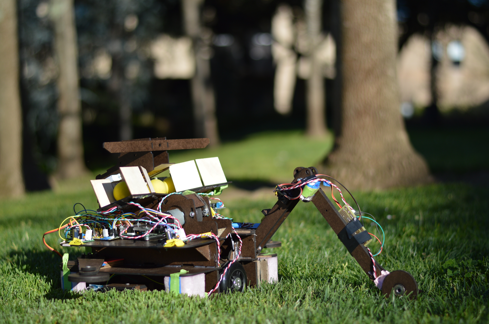
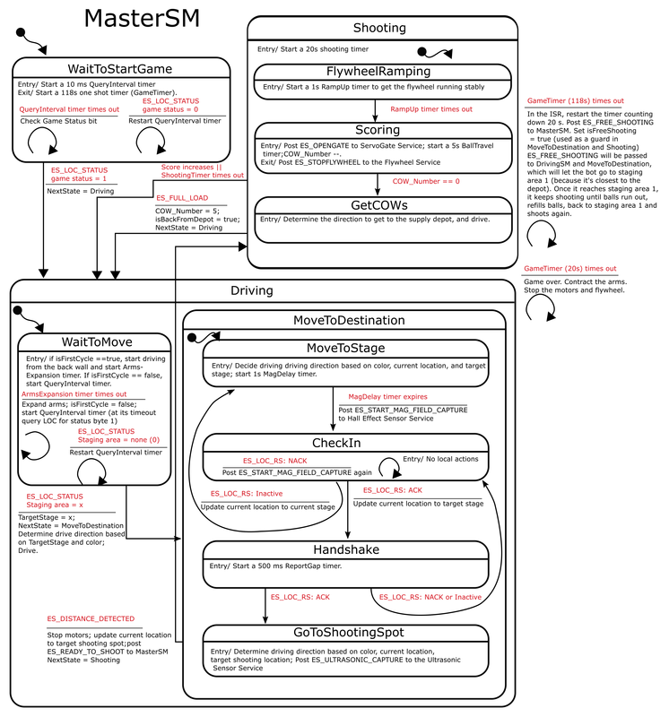
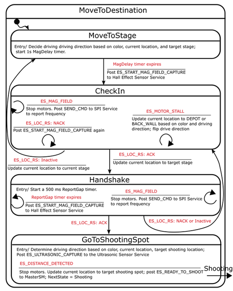
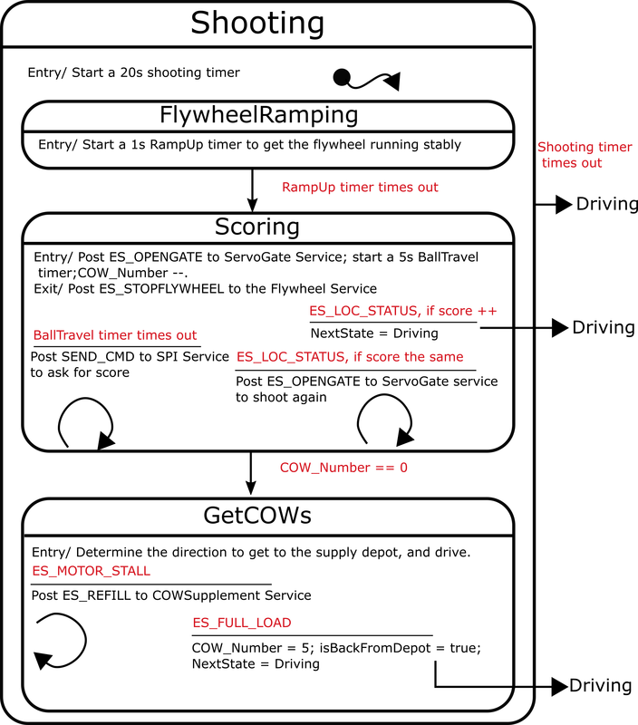

# ME218B Siege Tank
Siege Tank is a mechatronics project designed and built by [Jiajie He](https://www.linkedin.com/in/jiajie-he/), [Chi Zhang](https://www.linkedin.com/in/zhang-chi/), [Timothy Lee](https://www.linkedin.com/in/tlee732/) and [Zhengrong Shang](https://www.linkedin.com/in/zhengrongshang/). It is also a team project for Smart Product Design Applications [(ME218B)](http://explorecourses.stanford.edu/search?view=catalog&filter-coursestatus-Active=on&page=0&catalog=&academicYear=&q=ME218&collapse=) at Stanford University, Winter 2017.

:warning: This page serves as software description, please refer to the project [website](https://me218siegetank.weebly.com/) for more details on mechanical and eletrical systems setup.

## Overview

In Siege Tank's brain, there is a hierarchical state machine (HSM) supported by 8 services . The HSM posts/receives events to/from the services for different functionalities.

### SPI  Service:
Lets the master device (Tiva) write and read bytes from the slave device (LOC) to get information on game status, target staging areas, target buckets, and report captured magnetic field frequencies.
### DC Motor  Service:  
Provides functions that generate PWM of desired frequency and duty cycle, and switch rotation direction. PI velocity control is implemented here.
### Flywheel  Service:   
Runs the flywheel  motor stably with PI control.
### Servo Gate  Service:   
Controls the 4 servos for shooter gate, side supporting arms, and sensor arm.
### COW_Supplement Service:  
Sends IR pulses of 10 ms ON time and 30 ms OFF time to the supply depot to refill balls.
### Hall Effect Sensor  Service:   
Selects one of the two sensors based on the position of the target staging area. Averages received magnetic field pulses and returns a valid frequency.
### Ultrasonic Sensor Service: 
Triggers the ultrasonic distance sensor and receives the echo pulse. Then interprets distance from the echo pulse length.
### LED Service:  
Indicates  game color (red or green), and blinks during the process of supplementing COWs.

The state chart is shown below.

